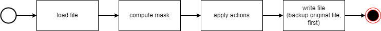

How degrotesque works
=====================

**degrotesque** is quite a simple tool.

For each collected file, **degrotesque** performs the following steps:

* load the file;
* compute the mask of what to process in dependence to the file type;
* apply the chosen actions to the unmasked part of the file contents;
* write the file, optionally building a backup of the file, first.

## Loading

The file is plainly loaded. Nothing special, despite the fact that you may define
the file's encoding.

## Masking

When processing plain text files, **degrotesque** is applied to the whole content.
This cannot be done when processing XML, HTML, or Markdown files as some 
parts - elements, attributes in XML/HTML-files or code parts in Markdown 
files - must be omitted.

As such, after loading a file, **degrotesque** computes a mask. The mask shows
which parts of the file contents shall be processed and which ones shall be
omitted. 

The mask is a string of the same length as the file contents. Parts that shall be 
processed are represented by a '0' ("zero" character), parts to omit by a '1' 
("one" character). **degrotesque** will simply skip the parts marked with a '1'
when applying the actions.

## Applying actions ("degrotesquing")

**degrotesque** builds a copy of the chosen actions, first.

When processing the document, the next occurence of a thing to change is determined,
first. If an action consists of two parts (e.g. " should occure twice), the second part is
searched. If an action has a second part, but it cannot be found in the document, the 
action is skipped. Actions that would be applied to something that does not occure in the 
(remainder of) the document are removed for speeding up the processing.

All found occurences are sorted by their position within the document. The first one
is then applied by replacing the initial characters by their prettier representation.

Then, the search for the action to process is repeated, starting after the performed 
replacement (the first part of it).

## Saving the result

Nothing special about this as well. Just backup the original file, save the 
results using the defined encoding.

No, there are no checks whether the encoding understands the changed contents.

